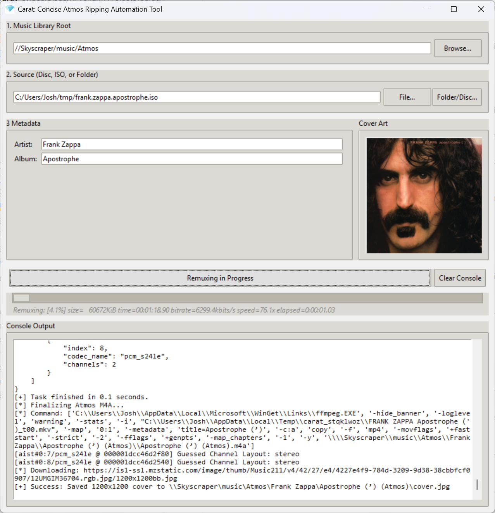

<!--suppress ALL -->

  
  
  # Carat
  **Diamond-perfect Atmos extraction, processing, and library integration.**

---

Carat is a lightweight, automated GUI utility designed to accept Dolby Atmos music releases from practically any format and incorporate them directly into your digital music library in a single click. 

From the moment a new Blu-ray arrives in your mailbox, Carat handles the entire pipeline—extraction, processing, metadata acquisition, and cover art—with zero friction. If your source files are already on your SSD, Carat will process an entire release in under a minute (depending on the speed of your computer). If you are starting from a physical disc, the time is limited by the read speed of your optical drive.

  

## The Universal Atmos Ingestion Tool
Carat is built to handle the chaotic, developing landscape of Atmos release formats. It natively accepts:
* Physical Blu-ray discs
* Blu-ray ISOs and BDMV backup folders
* [IAA](https://immersiveaudioalbum.com/)-style folders (individual MKV or MP4 files per track)
* [Headphone Dust](https://headphonedust.store/)-style single MKV files

**The Output:** Regardless of what you feed it, Carat standardizes the output into one uniform, library-ready format: **a single, chapterless `.m4a` file alongside a `.cue` sheet and a `cover.jpg`.** *Why this format?* It is currently the only format that reliably combines true gapless playback with accurate track indexing on media centers like Kodi.

As the landscape evolves, we may extend Carat's capabilities to support more input and output formats, but it will remain laser-focused on one task: quickly incorporating Atmos albums into your digital music library.

## Intelligent Metadata
You shouldn't have to manually tag your Atmos rips. Carat reaches out to top-tier sources—including [MusicBrainz](https://musicbrainz.org/), the [Cover Art Archive (CAA)](https://coverartarchive.org/), and [Apple/iTunes](https://www.apple.com/itunes/)—to automatically pull down high-quality cover art and pristine metadata, and applies smart heuristics to identify and correct imprecise artist or album names, ensuring your library remains perfectly organized.

## Installation (The Near-Zero-Touch Launcher)
Carat uses a highly robust, idempotent launcher script that handles both installation and execution. It is designed to never make a mess of your system. 

1. Download the latest `.zip` release and extract it to a folder.
2. **Windows**: Double-click `carat.bat`
3. **macOS**: Double-click `carat.command`
4. The launcher pretty much takes it from there. The first time you click it, it installs the program and runs it. Subsequently, it just runs it. The installation of some components, especially on Windows, will require you to click through the usual install screens, accepting all the defaults. Windows will ask for permission to install the components before it runs their installers. If you don't have [MakeMKV](https://www.makemkv.com/) installed yet, the Carat installer will open a page on your browser, and you'll have to install it yourself before continuing.

**How it works:** On its first run, the launcher automatically checks your system, downloads any missing dependencies (via Winget or Homebrew), builds an isolated Python virtual environment, and launches the GUI. *Did something get interrupted?* Just double-click it again! The script is strictly idempotent—you can run it as many times as necessary, and it will simply pick up where it left off without polluting your system. Subsequent runs will bypass the checks and launch instantly.

Feel free to move the entire Carat-Beta directory anywhere you like, or to rename it; it won't affect the operation of the program.

## Usage
1. Insert your disc or locate your source files.
2. Launch Carat.
3. Select your input (and library root, if this is the first time you've run Carat), enter the artist and the album title, and click **Rip Atmos**.
4. Keep going. Carat is built for batch processing. You can leave the app open and rip multiple albums in a single session without ever needing to restart. You can press Clear Console between albums if you like, but it's up to you.

## Advanced Usage (CLI & Programmatic)
While Carat features a fully automated GUI, the core engine is completely decoupled. Power users can:
* **Run Headless:** Execute Carat directly from the command line or import it programmatically into custom Python scripts for batch-processing.
* **Get Cover Art:** The `get_cover_art` module can be used in isolation, to scrape top-tier artwork from MusicBrainz/CAA and Apple/iTunes to upgrade your existing digital library.

## Under the Hood
Carat acts as an elegant conductor for the community's best open-source media tools. The entire program consists of fewer than 1,000 lines of Python (taking up just 1/10 the space of its 400x400 icon). The entire distribution, including the icon, would fit six times on a standard floppy disk. Carat is also aggressively hygienic: it goes to great lengths to clean up after itself. Even if it is forcefully closed mid-rip, it tracks its state to ensure that it never leaves orphaned background processes running, or abandons multi-gigabyte temporary files on your drive.

The underlying tools (which do all the heavy lifting) are:
* **GUI:** [Python/Tkinter](https://www.python.org/) 
* **Extraction:** `makemkvcon` ([MakeMKV](https://www.makemkv.com/))
* **Processing:** `ffmpeg` ([FFmpeg](https://ffmpeg.org/)) and `mkvmerge` ([MKVToolNix](https://mkvtoolnix.download/))

## Feedback & Bug Reports

* **Found a bug?** That's not surprising, considering that this is a Beta release. Please open an issue on the [GitHub Issues](https://github.com/jbloch/carat/issues) page. Including your console log or terminal output helps immensely!
* **Questions or feature ideas?** Join the discussion over on the [QQ Thread](link-to-your-QQ-thread).

---
*Created by Josh Bloch, because he was sick of doing all of this work manually*
